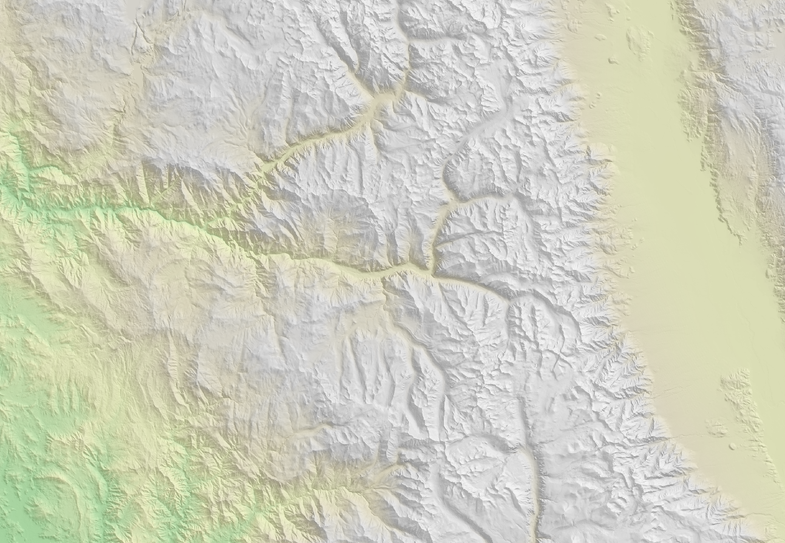

GDAL Hillshade Tutorial
=======================
Chris Henrick  
MapTime NYC   
Winter 2015



## Description

Participants will learn how to work with [Digital Elevation Model](http://en.wikipedia.org/wiki/Digital_elevation_model) data and use [GDAL](http://en.wikipedia.org/wiki/GDAL) to generate a [Shaded Relief / Hillshade](http://en.wikipedia.org/wiki/Terrain_cartography) for the Kings Canyon National Park area, in the southern Sierra Nevada mountain range, California. The commands in this tutorial are meant to be run in the Bash shell on Mac OS X or a Linux OS but these processes can also be accomplished using [QGIS](http://www2.qgis.org/en/site/).

## Assumptions

Ths tutorial assumes you have GDAL installed and that it is accessible from a [Command Line Interface](http://en.wikipedia.org/wiki/Command-line_interface) such as the [Terminal App](http://guides.macrumors.com/Terminal). Some familiarity with the Unix CLI is beneficial but not required.

MapBox has a [good tutorial on setting up GDAL](https://www.mapbox.com/tilemill/docs/guides/gdal/) if you need to do so.

## The Tutorial

### Step 1: Download data:
1. Make a new folder for this tutorial. Call it something like `gdal_hillshade_tutorial`.   
    - Then open up your terminal and `cd` to that folder by doing:   
    `cd /Users/username/gdal_hillshade_tutorial/`. 
    
    - Once you're in your project folder make another directory by doing `mkdir one-arc-second`, and then `cd` to it by doing `cd one-arc-second`.

2.  Put the following text in a file called url_list.txt:

	```
	ftp://rockyftp.cr.usgs.gov/vdelivery/Datasets/Staged/NED/1/GridFloat/n37w119.zip
	ftp://rockyftp.cr.usgs.gov/vdelivery/Datasets/Staged/NED/1/GridFloat/n38w119.zip
	ftp://rockyftp.cr.usgs.gov/vdelivery/Datasets/Staged/NED/1/GridFloat/n37w120.zip
	ftp://rockyftp.cr.usgs.gov/vdelivery/Datasets/Staged/NED/1/GridFloat/n38w120.zip
	```

3. Then using the `w-get` utility (available on Linux or via [Homebrew](http://brew.sh/) on a Mac), do:  
  `wget -i url_list.txt`. Go grab a beer or coffee. 

4. When the files have finished downloading unzip them by doing `open *.zip`.

**FYI:** This data comes from the USGS National Elevation Dataset which is available for download via the [National Map Viewer.](http://viewer.nationalmap.gov/viewer/)

### Step 2: Process DEM data

First `cd` up one directory, make a new directory called `processed_data` and `cd` to it.

1. Build a VRT file with GDAL:

	```
    gdalbuildvrt kings_canyon.vrt \
            ../one-arc-second/n37w119/floatn37w119_1.flt \
            ../one-arc-second/n37w120/floatn37w120_1.flt \
            ../one-arc-second/n38w119/floatn38w119_1.flt \
            ../one-arc-second/n38w120/floatn38w120_1.flt   
	```

2. Create a GeoTiff from the VRT file:  

	`gdal_translate -of GTiff kings_canyon.vrt kings_canyon.tif`

3. Project the data to CA State Plane 4 ft / EPSG:2228 and clip it to the surrounding area of the park

	```
	gdalwarp \
	-s_srs EPSG:4269 \
	-t_srs EPSG:2228 \
	-te 6513124 1921767 6841766 2380645 \
	-r bilinear \
	kings_canyon.tif kings_canyon_2228.tif
	```

	- **note**: the `-r bilinear` flag is useful to help avoid weird artifacts being created in the data during the reprojection process.

### Step 3: Generate the Hillshade, Slope Shade, and Color Relief
#### To Make the Hillshade:

Using the GDAL DEM tools we can now generate a hillshade:  
	
`gdaldem hillshade -az 45 -z 1.3 kings_canyon_2228.tif hillshade_az45.tif`  

- **note**: the `-az` flag is for the light direction and the `-v` flag is for vertical exaggeration. These may be changed as desired. 
- Generally, the smaller the scale of the map the more vertical exaggeration you would want to use. See the vertical exaggeration chart in the resources directory.

#### To Make the Color Relief:


Make a `color-relief.txt` file with the following values inside it:  

```
0 110 220 110
925 240 250 160
1850 230 220 170
2775 220 220 220
3700 250 250 250
```

Then generate the color-relief:

`gdaldem color-relief kings_canyon_2228.tif color-relief.txt kings_canyon_color_relief.tif`

#### To Make the Slope Shade:

Generate a slope:  
`gdaldem slope kings_canyon_2228.tif slope.tif`

Make a color-slope.txt file that will be used to generate the slope shade:
`touch color-slope.txt && printf '%s\n%s\n' '0 255 255 255' '90 0 0 0' >> color-slope.txt`

Finally make the slope shade:  
`gdaldem color-relief slope.tif color-slope.txt slope-shade.tif`

### Step 4: Combine all 3 layers in QGIS, TileMill or Photoshop.
Open the files in the software of your choice and layer them in the following order:  

1. Color Relief
2. Slope Shade
3. Hillshade

Then set the opacity for the top two layers to 50-80%. Try experimenting with this.

- In Tile Mill you can also use the `comp-op: multiply` effect which affects the way the layers are blended. If working in Tile Mill it's best to have your data projected to `EPSG:3785`. The following `CartoCSS` blends data well and you can tweak it by adjusting the opacity value and comp-op parameter:

	```
	Map {
	  background-color: #fff;
	}
	
	#hillshadeaz45 {
	  raster-opacity:0.8;
	}
	
	
	#slopeshade {
	  raster-opacity:0.8;
	  comp-op:multiply;
	}
	
	
	#colorrelief {
	  raster-opacity:0.8;
	  comp-op:multiply;  
	}
	```


- You could also composite these three files in Photoshop, though you'll have to georeference the composited file afterward as Photoshop won't transfer the data that contains the georeference information from the original files. To do this use `gdalinfo` to find the extent of one of the original files and then use `gdal_translate` utility like:

	```
	gdal_translate -of GTiff \
	-a_ullr <top_left_lon> <top_left_lat> <bottom_right_lon> <bottom_right_lat> \
	-a_srs EPSG:2228 \
	photoshopped_terrain.tif photoshopped_terrain_2228.tif
	```


### Resampling Terrain Data
If we want our hillshade to be less detailed we can resample our DEM data. Basically all we are doing is making the file a smaller size in pixel measurements (not the actual area it represents) so that each pixel will represent a larger square meter area. This is similar to reducing and resampling the size of a regular image in Photoshop or Gimp.

`gdalwarp -ts 3000 0 -r bilinear kings_canyon_2228.tif kings_canyon_2228_rs.tif`

- **note** leaving either the width or height as 0 will let GDAL guess the other dimension based on the input file size's aspect ratio.

Using `gdalinfo` we can see the resolution of our resampled data. Check the `Pixel Size` value in the output after doing: `gdalinfo kings_canyon_2228_rs.tif`. You'll see that it's larger than the original file.

You can then do the above steps to generate hillshade, slopeshade, etc. with the resampled data.


## Resources:
Located inside the resources directory.

- Tom Pattersons' web map shaded relief guide.
- ESRI's vertical exaggeration chart.
- Make-hillshade.sh is a [bash shell script](http://en.wikibooks.org/wiki/Bash_Shell_Scripting) to automate GDAL hillshade process. Takes the file name for a DEM as an argument when running, eg: `./make-hillshade.sh my-dem-data.tif`

## Other helpful links
- [Shadedrelief.com](http://www.shadedrelief.com/)
- [Thematic Mapping Blog](http://blog.thematicmapping.org/2012/06/digital-terrain-modeling-and-mapping.html)
- [GDAL Cheat Sheet](https://github.com/dwtkns/gdal-cheat-sheet)
- [EPSG.io](http://epsg.io)
- [Natural Earth Data](http://www.naturalearthdata.com/downloads/) for pre-rendered small scale hillshades.